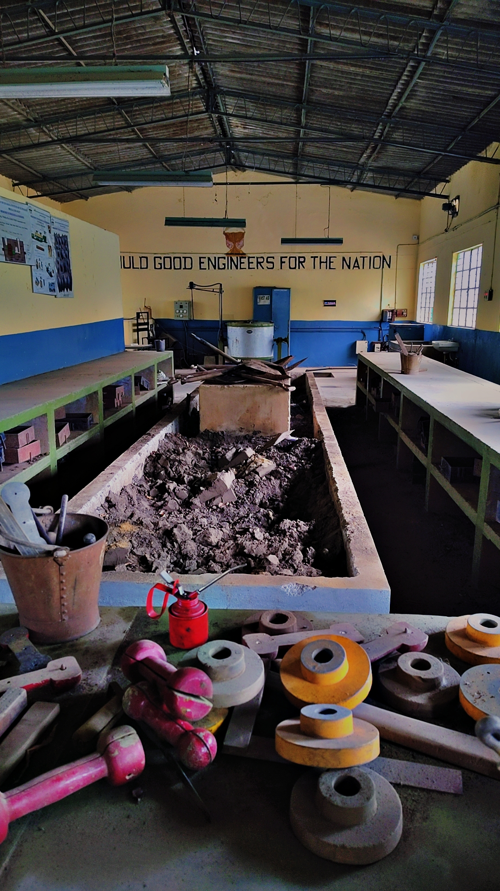

#  Casting & Mold Fabrication  
*(Manufacturing Technology Laboratory Experience)*

---

## Practical Training Overview

Hands-on exposure to sand casting and mold fabrication processes 
as part of manufacturing laboratory coursework.

Activities performed in a controlled foundry workshop environment 
including furnace operation observation, mold preparation, and 
casting setup procedures.

---

##  Foundry & Furnace Environment

  

Exposure to open hearth furnace system used for melting operations.

Key Learnings:
- Basic melting process workflow
- Safety protocols in foundry operations
- Heat-resistant material handling awareness
- Furnace structure and airflow control understanding

---

##  Sand Casting & Mold Preparation

  

Hands-on experience in:

- Pattern placement
- Sand ramming techniques
- Mold cavity preparation
- Core placement basics
- Gating system understanding
- Riser and vent considerations

---

##  Mold Fabrication Tools & Equipment

  

Tools used during fabrication process:

- Rammers
- Ladles
- Trowels
- Pattern blocks
- Sand compacting tools

---

##  Casting Process Demonstration

[▶️ Watch Casting Demo – Process Video 1](./images/casting-demo-1.mp4)  
[▶️ Watch Casting Demo – Process Video 2](./images/casting-demo-2.mp4)

Videos demonstrate:

- Mold preparation workflow
- Furnace environment
- Sand cavity setup
- Casting stage preparation

---

##  Technical Concepts Understood

- Shrinkage allowance
- Pattern design basics
- Gating & riser system fundamentals
- Mold strength vs permeability tradeoff
- Defect awareness (porosity, misrun, shrinkage cavity)
- Post-casting finishing basics

---

##  Relevance to Robotics & Mechanical Engineering

Understanding casting and mold fabrication enhances:

- Knowledge of manufacturing constraints
- Material behavior awareness
- Design-for-manufacturability thinking
- Component geometry optimization
- Structural part planning

