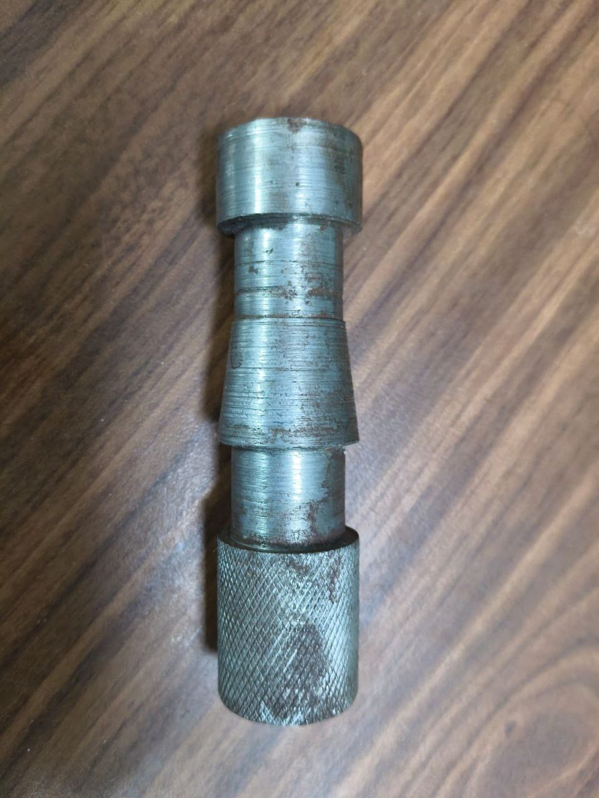
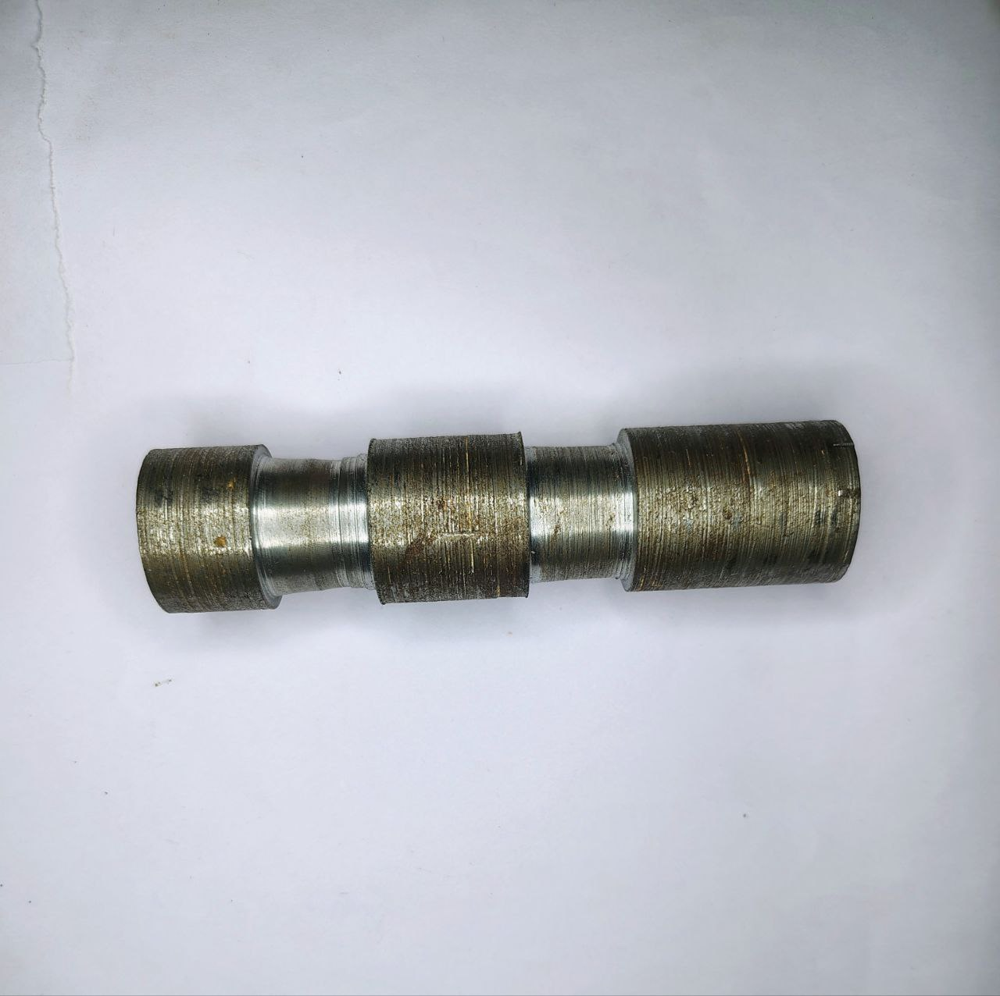

# Manual Machining & Lathe Operations  
*(Manufacturing Laboratory – Conventional Lathe Training)*

---

##  Practical Training Overview

Hands-on training in conventional lathe machining 
as part of manufacturing laboratory coursework.

Independently operated the lathe machine to fabricate 
multiple stepped shaft components with taper and knurling features.

---

##  Workpiece 1 – Stepped Shaft with Knurling

  

Operations performed:

- Facing
- Step turning
- Shoulder formation
- Knurling operation
- Surface finishing

Key learning:
- Knurling pressure control
- Feed rate influence on surface texture
- Diameter accuracy maintenance

---

##  Workpiece 2 – Multi-Diameter Tapered Shaft

  

Operations performed:

- Facing
- Diameter reduction
- Taper turning
- Shoulder machining
- Surface smoothing

Key learning:
- Controlled taper angle generation
- Tool positioning precision
- Sequential machining strategy

---

##  Lathe Operation Demonstration

[ Watch Lathe Operation ](https://drive.google.com/file/d/1cvh7D7OjkBeQfrZXGnsyRkX1dWg5Keg7/view?usp=sharing)

Video demonstrates:

- Workpiece mounting & alignment
- Tool positioning
- Feed control during turning
- Safe handling of rotating machinery
- Real-time machining execution

---

##  Technical Competencies Developed

- Spindle speed selection
- Feed rate calculation
- Tool geometry awareness
- Cutting depth control
- Material removal strategy
- Dimensional verification using Vernier calipers
- Safety protocol adherence

---

##  Relevance to Robotics & Mechanical Systems

Lathe machining capability enables:

- Custom shaft fabrication
- Motor coupling manufacturing
- Spacer and adapter production
- Precision rotating component design
- Mechanical system integration

