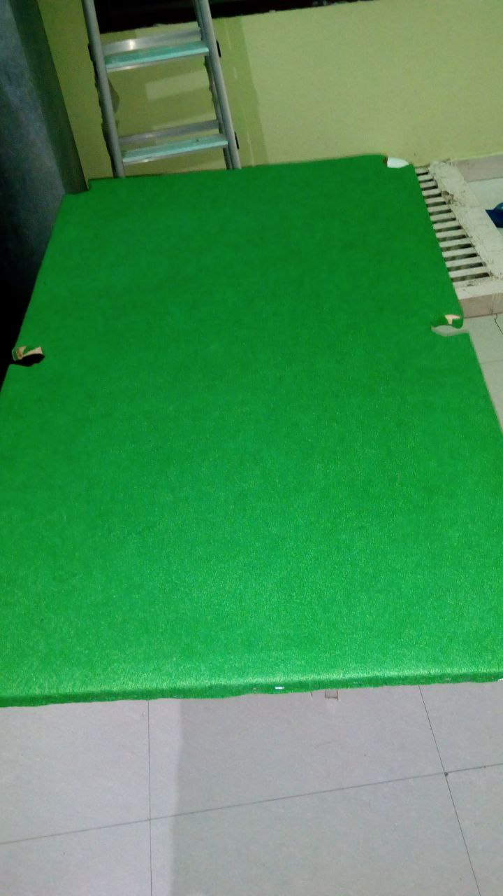

# Woodworking & Manual Fabrication  
*(Independent Hobby Project – 2018)*

---

## DIY Pool Table Construction (Grade 8 Project)

At the age of 14, I independently designed and built a 
functional pool table as a hobby engineering project.

This early project reflects my foundational interest in 
mechanical design and hands-on fabrication.

---

## Project Snapshot

  

---

## Fabrication Involved

- Structural frame assembly
- Plywood/MDF surface preparation
- Surface leveling considerations
- Felt surface installation
- Edge finishing & alignment
- Manual cutting & fitting

---

## Engineering Thinking Applied

- Surface flatness importance for ball dynamics
- Frame stability & load distribution
- Dimensional measurement and symmetry
- Material selection based on availability
- Practical problem-solving during assembly

---

## Reflection

Building a pool table at a young age strengthened my 
interest in mechanical systems and structural fabrication.

